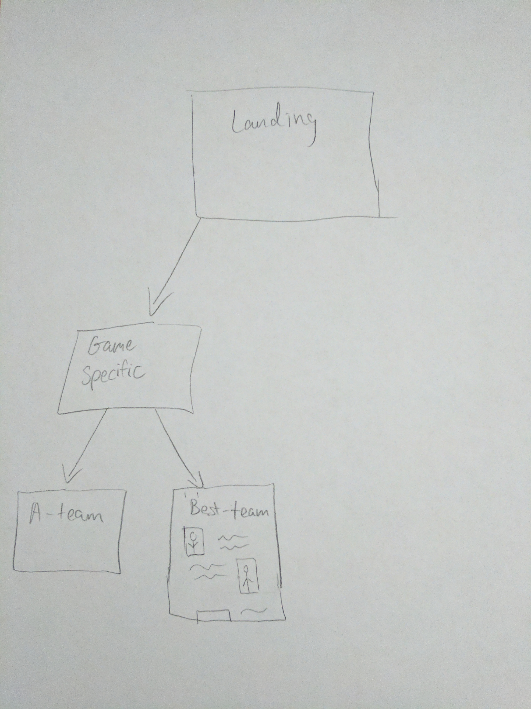

# Planning
## Todo
- Fork MaterializeCSS to include Clemson's colors (https://github.com/ClemsonEsports/materialize)
- Pick a templating system and create templates for game-specific landing pages and team pages.
- Get pictures and bios of players

## Structure

